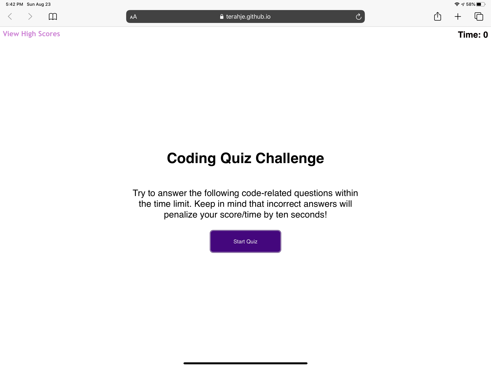

# Web APIs Challenge: Code Quiz

**Description:  Coding quiz that tests your knowledge on various things we've learned thus far.** 

As you land on the home page of the quiz, simply press the button to start the quiz. You will be meet with 5 mulitple choice questions testing your coding knowledge.  You get 1 point for being corrects, but you will lose 25 seconds for every incorrect answer.  So choose wisely.

Technologies Used: HTML, CSS, JavaScript

https://terahje.github.io/week-4-challenge/

